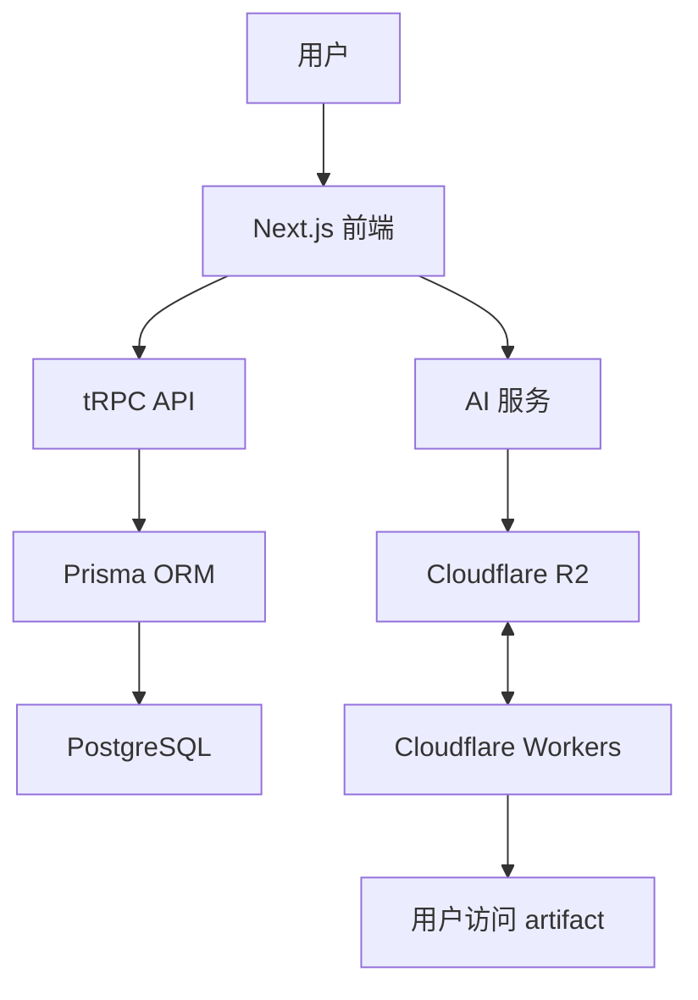

# 1 架构设计

[00-项目初始思路](00-项目初始思路.md) 是项目的概念设计，接下来我们结合已经验证的部分，重点讨论架构设计。

我们确定的架构：

- T3 Stack 做站点主体，NextJS、TailwindCSS、TypeScript、TRPC
- 数据库用自己 host 的 postgres + prisma
- 托管数据在 CF R2，中间件和组件注入用 CF Worker

[instruction.md](instruction.md) 也有一些技术要求。

根据概念设计的要求，给我做一个 vibesgram.com 的架构文档。
- 简洁明了，不要有太多多余的要求，保持 MVP
- 不需要写任何代码，用纯文本给我叙述
- 画图的话用 mermaid

# Vibesgram.com 架构设计文档 (最终版)

## 1. 系统概述

Vibesgram 是一个面向 vibe coding 创作者的社交平台，允许用户创建、分享和发现 AI 生成的网站和单文件 artifacts。

## 2. 系统架构

### 2.1 核心组件

主站应用 (vibesgram.com)
- 基于 T3 Stack 构建的 Next.js 应用
- 处理用户认证、内容管理和社交功能
- 提供 AI 创作界面和编辑器
- 处理图像优化和预览生成

Artifact 托管服务
- 使用 Cloudflare Workers 托管用户创建的 artifacts
- 支持静态文件服务和动态内容注入
- 提供不同类型的子域名访问

存储层
- Cloudflare R2 用于存储用户上传的 artifacts 和静态资源
- PostgreSQL 数据库存储用户数据、元数据和交互数据

AI 服务
- Vibesgram Agent 集成到创作流程中
- 提供代码生成、格式转换和元数据填充功能

### 2.2 数据流



## 3. URL 设计

### 3.1 主站 URL 结构

主页和发现
- / - 主页/登录页
- /explore - 发现页面
- /explore/trending - 热门内容
- /explore/latest - 最新内容
- /explore/following - 关注内容

用户相关
- /@{username} - 用户个人主页
- /@{username}/artifacts - 用户作品列表
- /@{username}/following - 用户关注列表
- /@{username}/followers - 用户粉丝列表
- /settings - 用户设置

创作相关
- /agent - 创建/编辑 artifact (是一个统一 chat 界面。agent 就是蹭热点的名字)
- /a/{artifactId} - artifact 详情页

创作者后台
- /dashboard - 创作者仪表盘主页
- /dashboard/artifacts - 管理所有 artifacts
- /dashboard/analytics - 简单数据分析

认证相关
- /signin - 登录
- /signup - 注册

其他
- /about - 关于我们
- /tos - 服务条款
- /privacy-policy - 隐私政策

### 3.2 Artifact 托管 URL 结构

已发布 Artifact
- {cuid}.vibesgram.app - 已发布 artifact 访问
- {cuid}.vibesgram.app/{path} - artifact 内部路径

临时预览 Artifact
- preview-{cuid}.vibesgram.app - 临时编辑预览和游客 artifact
- preview-{cuid}.vibesgram.app/{path} - 临时 artifact 内部路径

自定义域名 (付费功能)
- {custom-name}.{username}.vibesgram.app - 自定义子域名

## 4. 数据库设计

User
- 基本用户信息
- 唯一用户名 (URL 友好)
- 认证和权限信息

Artifact
- 元数据 (标题、描述、主语言等)
- 存储路径 (R2 路径)
- 创建和更新时间
- 发布状态
- 所有者关联

Interaction
- 点赞
- 评论
- 收藏
- 浏览统计

Follow
- 用户关注关系

Notification
- 站内通知系统

ArtifactAnalytics
- 关联到特定 artifact
- 访问统计数据
- 互动统计数据

## 5. R2 存储路径设计

### 5.1 基本路径结构

```
vibesgram-artifacts/
├── public/
│   └── {artifactId}/
│       ├── content/       # 实际提供服务的内容
│       │   ├── index.html
│       │   ├── assets/
│       │   └── ...
│       └── metadata.json  # 额外元数据
└── preview/
    └── {artifactId}/
        ├── content/
        │   ├── index.html
        │   └── ...
        └── metadata.json
```

### 5.2 存储策略

注册用户已发布 Artifacts
- 路径: users/{userId}/{artifactId}/content/
- 永久存储，除非用户删除
- 元数据: users/{userId}/{artifactId}/metadata.json
- 访问域名: {cuid}.vibesgram.app

临时预览 Artifacts (编辑预览和游客)
- 路径: preview/{artifactId}/content/
- 设置 3 小时过期时间
- 元数据: preview/{artifactId}/metadata.json
- 实现方式:
  - 使用 Cloudflare R2 生命周期规则自动删除过期对象
- 访问域名: preview-{cuid}.vibesgram.app

### 5.3 访问控制

- 配置适当的 CORS 策略，只允许来自 vibesgram.com 和 .vibesgram.app 的请求
- 使用 Cloudflare Worker 作为代理，防止直接访问 R2 资源
- 实现基于 referer 的防盗链措施

## 6. API 设计

使用 tRPC 构建类型安全的 API，主要路由分组：
- auth - 用户认证和授权
- artifact - 创建、编辑、发布 artifacts
- user - 用户资料和关注
- social - 点赞、评论、收藏
- feed - 信息流和发现
- agent - AI 创作助手接口
- dashboard - 创作者后台功能

## 7. 安全考量

内容安全
- 实现基本的内容过滤和审核机制
- 用户举报功能
- 防止滥用平台资源

数据安全
- 用户数据加密存储
- 明确的隐私政策
- 完善的数据删除机制

资源限制
- 临时部署限制 (3小时过期)
- 文件大小限制 (10MB)
- 文件数量限制 (100个文件)
- 防止平台被用作无限制的文件存储