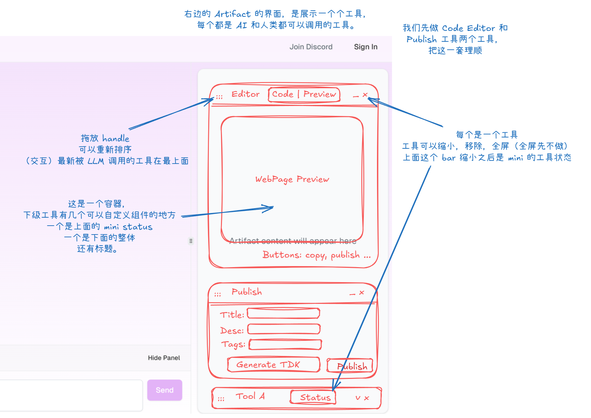

# Artifact 界面设计

（提供 Excalidraw 的截图）

我们接下来做 @artifact-content.tsx 的界面设计和规划。

帮我先用纯文本系统梳理这个界面上的设计要求，用正规的设计语言。

不要写任何代码。不用画图，我之后会把这个图放仓库里面。

中文。

# Artifact 内容面板设计规范

## 正确的层次结构

ArtifactContent 是一个容器组件，其结构组织如下：
- **ArtifactContent**: 顶层容器
  - **工具列表**: 包含多个独立工具
    - **单个工具**: 每个工具包含：
      - 工具栏: 工具的控制区域
      - 内容显示区域: 可包含任意内容的主区域

## 工具列表特性

1. **垂直排列**: 工具按垂直方向排列，形成一个列表
2. **可配置性**: 用户可以调整列表中工具的顺序
3. **动态性**: 可根据需要添加或移除工具
4. **状态记忆**: 系统会记住最近使用的工具排序

## 单个工具组件设计

### 工具栏
- **左侧**:
  - 拖拽句柄: 用于调整工具在列表中的位置
  - 工具标识: 显示工具名称（如"Editor", "Publish", "Tool A"等）
  
- **右侧**:
  - 状态指示器: 显示工具当前状态，也可以做一些交互
    - 其他功能按钮: 根据特定工具可能有所不同
  - 控制按钮: 最小化/最大化、关闭按钮

### 内容显示区域
- **适应性**: 能够容纳任意类型的内容
- **灵活性**: 根据工具类型显示不同的内容
  - 编辑器工具: 可显示代码编辑器、预览等
  - 发布工具: 显示表单、选项等
  - 其他工具: 根据具体功能定制内容

## 工具状态管理

- **展开状态**: 完整显示工具栏和内容区
- **最小化状态**: 仅显示工具栏，内容区域折叠
- **激活状态**: 当前正在使用的工具可能有特殊的视觉强调

## 工具交互行为

- **拖拽重排**: 用户可以通过拖拽工具栏来调整工具位置
- **展开/折叠**: 点击工具栏上的控制按钮可展开或折叠内容区
- **工具切换**: 用户可以在不同工具之间自由切换
- **工具配置**: 某些工具可能提供内部配置选项

## 具体工具示例

### 编辑器工具
- 工具栏包含"Editor"、"Code"、"Preview"等标签页
- 内容区根据选中标签显示相应内容
- 底部可能有复制、发布等操作按钮

### 发布工具
- 用于内容发布的专用工具
- 包含标题、描述、标签等输入字段
- 提供"Generate TDK"和"Publish"等功能按钮

### 状态工具
- 显示当前系统状态或进度
- 可能包含各种状态指示器和控制选项

## 设计原则

1. **一致性**: 所有工具遵循统一的设计语言
2. **模块化**: 每个工具是独立的功能单元
3. **可扩展性**: 系统应能方便地添加新工具
4. **用户控制**: 用户可以自定义工具的顺序和显示状态
5. **直观性**: 工具的功能和状态应当一目了然
