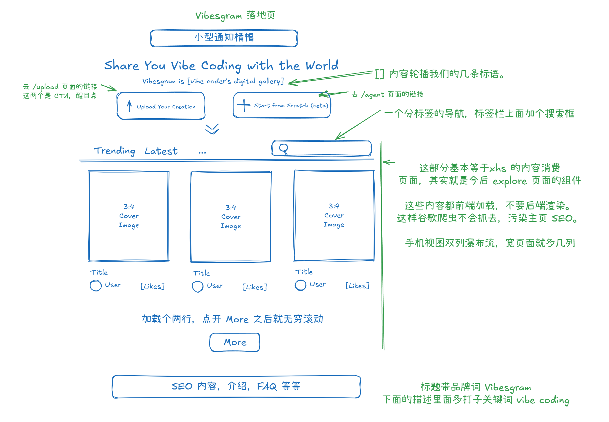

# 5 主页设计

接下来我们做主页的设计和规划。

根据上面的图，帮我先用纯文本系统梳理这个界面上的设计要求，用正规的设计语言。

另外也帮我看看，有没有什么遗漏的地方，或者可以优化的地方。

不要写任何代码，不用画图，使用中文回复。

@00-项目初始思路.md @2-运营思路.md 这是项目的概念设计等文档。

# 梳理结果



# 追问

OK，现在我们更新设计图成这样了，帮我规划一下主页的组件结构。

用纯文本给出组件设计。我们已经有一些组件放在 components/sections ，例如 @faq.tsx。

不要写任何代码，不用画图，使用中文回复。

# 组件设计结构

## 文件树结构

```
components/
├── layout/
│   └── main-layout.tsx (已有，包含 Header 和 Footer)
├── sections/
│   ├── hero.tsx (包含网站标题、标语、描述和主要功能入口按钮)
│   ├── features.tsx (已有，用于 SEO 内容)
│   ├── who-is-it-for.tsx (已有，可用于 SEO 内容)
│   └── faq.tsx (已有，常见问题解答)
└── content/
    ├── content-section.tsx (内容展示区整体容器)
    ├── content-grid.tsx (内容卡片网格布局)
    ├── content-card.tsx (单个内容卡片)
    ├── content-tabs.tsx (内容分类标签导航)
    ├── search-bar.tsx (搜索功能)
    └── load-more.tsx (加载更多按钮)
```

## 组件说明

### 1. 核心页面结构
- **main-layout.tsx**：已有的布局组件，包含 Header 和 Footer

### 2. 主要区域组件
- **hero.tsx**：第一屏展示区，包含网站标题、标语、描述以及"Upload Your Creation"和"Start from Scratch"两个主要功能入口按钮

### 3. SEO 内容区域
- **features.tsx**：已有组件，用于展示 Vibesgram 的主要功能和特点
- **who-is-it-for.tsx**：已有组件，说明目标用户群体
- **faq.tsx**：已有组件，常见问题解答

### 4. 内容展示相关组件
- **content-section.tsx**：内容展示区的主容器，管理所有内容相关组件
- **content-grid.tsx**：管理内容卡片的网格布局，处理响应式排列
- **content-card.tsx**：单个内容卡片组件，展示封面图、标题、用户和点赞信息
- **content-tabs.tsx**：内容分类标签，如 Trending、Latest 等
- **search-bar.tsx**：搜索功能组件
- **load-more.tsx**：加载更多按钮组件

## 页面组织

1. **首屏区域**：由 hero.tsx 组成，包含网站标题、标语和主要功能入口按钮

2. **内容展示区**：由 content-section.tsx 管理，整合其他内容相关组件

3. **SEO 内容区**：由 features.tsx、who-is-it-for.tsx 和 faq.tsx 组成，提供有价值的站点信息，优化 SEO
